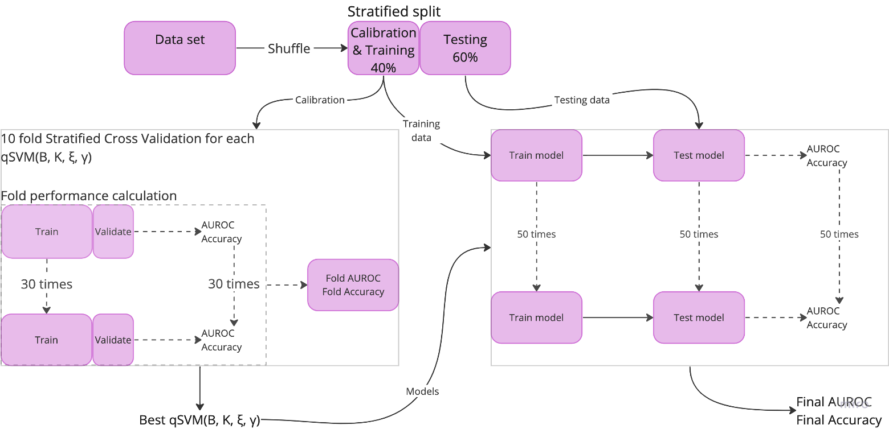

# Kernel Support Vector Machines for Quantum Annealing

## Table of contents

## Generl Info

The code in this repository is for my research project on training kernel support vector machines (SVM) on quantum annealers. 
The aim of the project was to test whether SVM on a quantum annealer can produce models as good if not better than classically trained SVM.
In order to test this, we formulate the SVM training problem as a quadratic unconstrained binary optimisation (QUBO) problem, which we solve using simulated and quantum annealing across 6 data sets, and compare the results to classically trained SVM (cSVM).
For each data set, we calibrate cSVM and QUBO SVM on the training data, using stratified cross validation, using AUROC and accuracy as the performance metrics. 
QUBO SVM was calibrated with simulated annealing, and later tested using both simulated and quantum annealing.
Once the best hyper-parameters were found, the models were trained on the full training data --- using simulated and quantum annealing int he case of QUBO SVM --- and tested on the test data.



To train cSVM, we use the CVXOPT module in python. For simulated annealing, we have our own code. For quantum annealing, we used the DWave Leap cloud platform which contains many of the functions necessary to run quantum annealing on their annealers (https://cloud.dwavesys.com/leap/login/?next=/leap/). 

## Technologies

python 3.9.13

We used an anaconda environment which included the following packages:
numpy 1.21.5
matplotlib 3.5.2
scikit-learn 1.0.2
scipy 1.9.1
cvxopt 1.2.6

From DWave Leap:
dwave.system.composites.EmbeddingComposite
dwave.system.samplers.DWaveSampler

## Features

### kernel_SVM_functions.py

This script contains the necessary funtions for the SoftMarginKernelClassifier (cSVM) from the classifiers.py file.
Functions include:
 - `rbf_kernel()`
 - `train_qp()`, solve cSVM training problem using CVXOPT
 - `get_support_vectors()`, determines the support vectors from the solution to the cSVM training problem
 - `score_kSVM()`, returns scores for inputted test data

### QUBO_SVM_functions.py

Necessary funtions to formulate an SVM training problem into a QUBO and solve the training problem using simulated annealing.
Functions include:
 - `encode_binary()` and `decode()`, for decoding solutions.
 - `make_QUBO_matrices()`, makes the QUBO problem
 - `solve_QUBO()`, solves the QUBO problem with simulated annealing

### simulated_annealing.py

Code for simulated annealing. Contains the QObjectiveFunction, which defines an objective function, created from QUBO matrices, for simulated annealing to solve. 
`QUBOSoftMarginClassifier` uses the QObjectiveFunction to define the training problem for simulated annealing to solve.
Notable functions include:
 - class `QObjectiveFunction`
 - `run_annealing()` Hyper-parameters we used were `(alpha=5, m_rate=1/K, N=100, t0=10)`

### classifiers.py

File contains two of the three classifier models `SoftMarginKernelClassifier` (cSVM) and `QUBOSoftMarginClassifier` which is the QUBO SVM whose training problem is solved using simulated annealing. 
Each is written in the framework of a sklearn classifier so they contain: `.fit()`, `.decision_function()`, `.predict()`, `.predict_proba()`
Note: the `.fit()` function for `QUBOSoftMarginClassifier` is split up since we need to create the QUBO problem first.
We will come to usage later.

### cross_validation.py

This file contains only one function: `qp_cross_validate()` which can be used to cross validate either a `SoftMarginKernelClassifier` or `QUBOSoftMarginClassifier`. 
An important argument is the `num_models = 1` which deteremines the number of times to evaluate the model on each fold. For cSVM this is default at 1, but for QUBO SVM, this is set to 30.

### parameter_tuning.py

This contains two functions `tune_qsvm_parameters` and `tune_csvm_parameters` which do the same thing but for different models. 
Both functions will initialise a model with each combination of hyper-parameters from the lists provided, then cross validate that model on the training set, and evaluate the model's ARUOC and Accuracy, returning them in a numpy matrix at the end. 


### Quantum Annealing (dir)

This directory contains all of the code used for quantum annealing. 

quantum_classifier.py includes the class `QSVMq` which is a QUBO SVM classifier trained using Quantum Annealing. In order to use this class, and indeed any other file in this directory, you need access to the DWave modules mentioned in the Technologies section. 

quantum_annealing_functions.py contains functions for cross validation, calibration, and running an ensemble classifier. However, as explained in our report, only the ensemble classifier function `bagged_models` is used. 
To run a bagged classifier, edit the run_bagged_classifier.py file with desired hyper-parameters, filepaths, and data. 

Files not used: run_QA.py, which runs calibration. 

### Other

 - *DataAnalysis*, contains analysis of each data set.
 - *iris_data*, contains everything to do with the iris data sets including figures.
 - *make_data_scripts*, containst scripts used for making synthetic data
 - *QA_bagged_results*, containts solutions from quantum annealer for ensemble classifiers on synth-3 and sytnh-4 data set. Also contains the AUROC and Accuracy scores for each model. See `quantum_annealing/QA_data_analysis.ipynb` for analysis.
 - *results*, calibration results from cSVM and QUBO SVM trained with simulated annealing.
 - *synth_data*, contains synthetic data sets.

## Usage

Import data.
```
data = np.loadtxt(f'synth_data/synth_0.4.csv', delimiter = ',')
X = data[:, :-1]
t = data[:, -1]

X_train, X_test, t_train, t_test = train_test_split(X, t, train_size = 0.3, shuffle = True, stratify = t)

t_train = t_train.reshape(-1, 1)
t_test = t_test.reshape(-1, 1)

```
t should be N dimensaionl, hence the reshaping.

### classic SVM

`from classifiers import SoftMarginKernelClassifier`

Initialise the classifier

`clf = SoftMarginKernelClassifier(4, rbf_kernel, 2)`

Fit to data
`clf = clf.fit(X_train, t_train)`

predict and score test data
`preds = clf.predict(X_test)`
`scores = clf.decision_function(X_test)`

Calculate AUROC and accuracy
```
from metric_functions import compute_auc_from_scores, compute_accuracy

AUROC = compute_auc_from_scores(scores, t_test)
accuracy = compute_accuracy(preds, t_test)
```

### QUBO SVM with simulated annealing

`from classifiers import QUBOSoftMarginClassifier`

Intitialise
`qclf = QUBOSoftMarginClassifier(2, 2, 3, rbf_kernel, 4)`

Make QUBO problem and fit
`qclf = qclf.make_QUBO_problem(X_train, t_train).fit(X_train, t_train)`

Predit and score test data
`scores = qclf.decision_function(X_test)`
`preds = qclf.predict(X_test)`

Calculate AUROC and accuracy
```
from metric_functions import compute_auc_from_scores, compute_accuracy

AUROC = compute_auc_from_scores(scores, t_test)
accuracy = compute_accuracy(preds, t_test)
```

### QUBO SVM with quantum annealing

Again, make sure you're using the DWave Leap environment.

`from quantum_classifier import QSVMq`

initialise
`qa_clf = QSVMq(2, 2, 3, rbf_kernel, 4)`

Make QUBO problem and fit
`qa_clf = qa_clf.make_QUBO_problem(X_train, t_train).fit(X_train, t_train)`

If you want to avoid this step for testing purposes, you can manually set the alphas for the model using the method `qa_clf.set_model(X_train, t_train, alphas)`.
If you do this, ensure alphas is an N dimensional array, where N is the number of feature vectors in the training set X_train.

Predit and score test data
`scores = qa_clf.decision_function(X_test)`
`preds = qa_clf.predict(X_test)`

Calculate AUROC and accuracy
```
from metric_functions import compute_auc_from_scores, compute_accuracy

AUROC = compute_auc_from_scores(scores, t_test)
accuracy = compute_accuracy(preds, t_test)
```

## Acknowledgements 

Thanks to Alberto Moraglio from Exeter University, Mayowa Ayodele from Fujitsu Research, and Marcos Diezgarcia also at Fujitsu, for supervising me on this project.